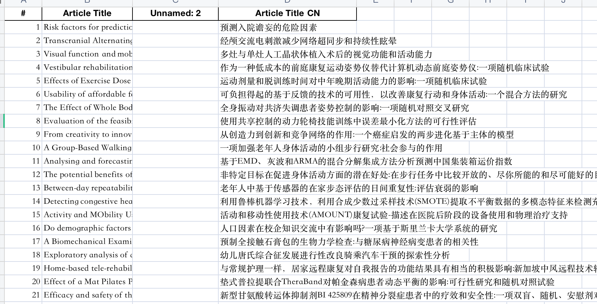

# 有道翻译专业词汇表

## 1. 运行说明
- 安装packages:`pip install -r requirements.txt`
- 将`.env-example`重命名为`.env`, 并在`.env`中填入有道翻译的app_key和app_secrect
- `python translator.py`即可

## 2. 运行结果
`translator.py`将`sys_reiview_1-2200_Jiaxin_1.xlsx`表中的`Article Title`翻译为中文，并添加到`Article Title CN`列，如下图像所示:



## 3. 其他
### 3.1 关于保存机制
为了节省保留的翻译资源，`translator.py`采用边翻译边保存的方式，即便是中途中断了，已翻译的内容也不用重新翻译了

### 3.2 关于for循环中requests请求失败的
在for循环中的，requests的会报如下错误:`requests.exceptions.ConnectionError: ('Connection aborted.', ConnectionResetError(54, 'Connection reset by peer'))`;

本脚本通过两个方面预防该错误:   
- 在`headers`增加一个随机的`User-Agent`
- 都每一个`requests.post`使用`while`循环，在捕获到异常的时候，重新连接，如脚本中`do_request`方法所示

```python
    def do_request(self, url, data, try_num=5):
        headers = {'Content-Type': 'application/x-www-form-urlencoded'}
        user_agent_list = ["Mozilla/5.0 (Windows NT 10.0; WOW64) AppleWebKit/537.36 (KHTML, like Gecko) Chrome/68.0.3440.106 Safari/537.36",
                    "Mozilla/5.0 (Windows NT 10.0; WOW64) AppleWebKit/537.36 (KHTML, like Gecko) Chrome/67.0.3396.99 Safari/537.36",
                    "Mozilla/5.0 (Windows NT 10.0; WOW64) AppleWebKit/537.36 (KHTML, like Gecko) Chrome/64.0.3282.186 Safari/537.36",
                    "Mozilla/5.0 (X11; Linux x86_64) AppleWebKit/537.36 (KHTML, like Gecko) Chrome/62.0.3202.62 Safari/537.36",
                    "Mozilla/5.0 (Windows NT 6.1; WOW64) AppleWebKit/537.36 (KHTML, like Gecko) Chrome/45.0.2454.101 Safari/537.36",
                    "Mozilla/4.0 (compatible; MSIE 7.0; Windows NT 6.0)",
                    "Mozilla/5.0 (Macintosh; U; PPC Mac OS X 10.5; en-US; rv:1.9.2.15) Gecko/20110303 Firefox/3.6.15",]
        # print(random.choice(user_agent_list))
        user_agent = random.choice(user_agent_list)
        # print(user_agent)
        headers['User-Agent'] = user_agent
        while try_num > 0:
            try:
                result = requests.post(url, data=data, headers=headers)
                try_num = 0
            except requests.exceptions.ConnectionError as ex:
                if try_num <= 0:
                    print("Failed to retrieve: " + url + "\n" + str(ex))
                else:
                    print("{}:连接失败，剩余尝试次数:{}".format(url, try_num))
                    try_num -= 1
                    time.sleep(0.5)

        return result
```
